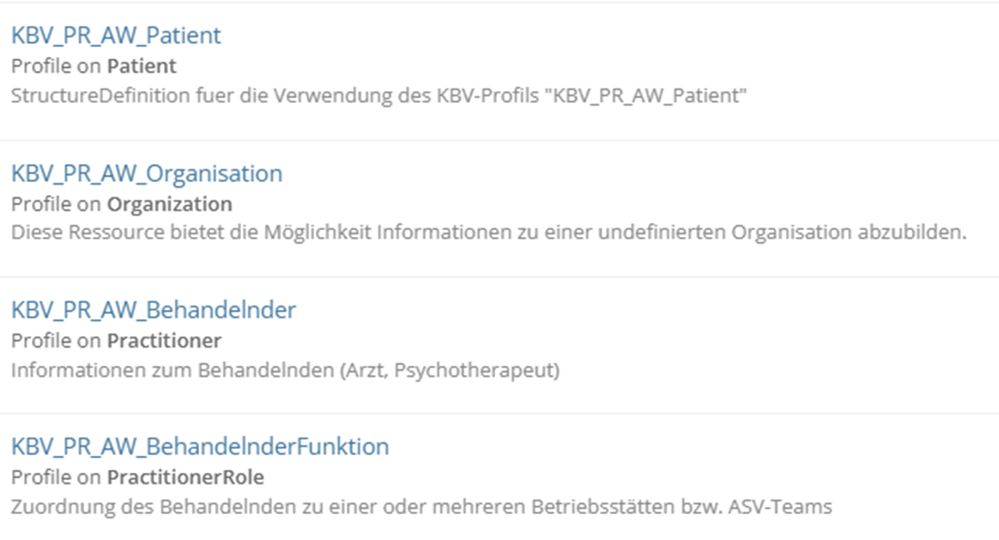
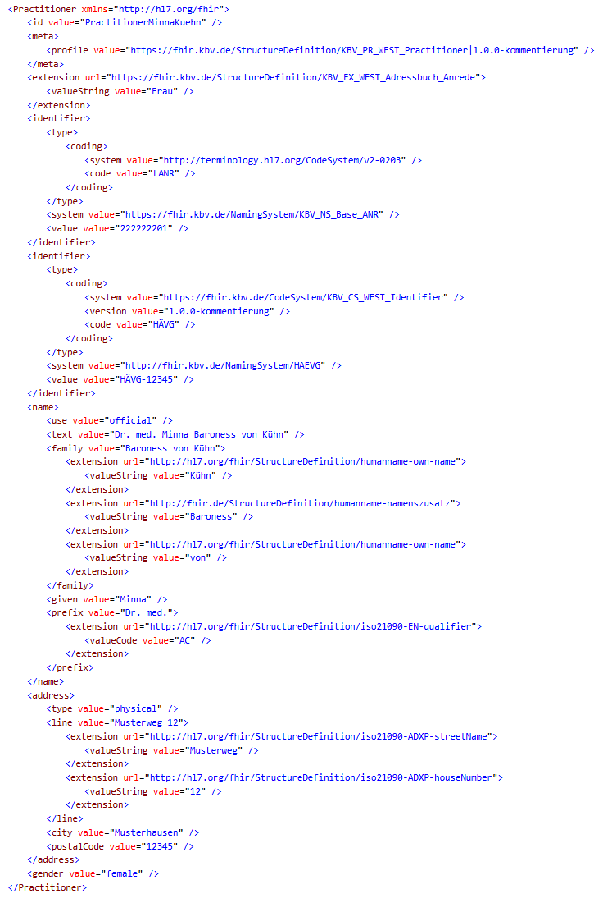
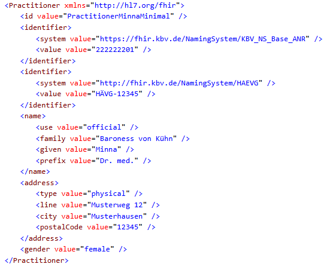

# Arbeitspaket 1 - abgeschlossen - Arbeitsgruppe WeST v1.0.0-kommentierung

Arbeitsgruppe WeST

Version 1.0.0-kommentierung - ci-build 

* [**Table of Contents**](toc.md)
* **Arbeitspaket 1 - abgeschlossen**

## Arbeitspaket 1 - abgeschlossen

### Inhalt

#### Arbeitspaket 1 (Kommentierung abgeschlossen)

Informationsmodell
 

FHIR-Ressourcen

### Kommentarauflösung

Nach Abschluss der Kommentierung und der Prüfung sowie Bewertung aller eingegangenen Kommentare ist hier ein Überblick zu den eingegangenen Kommentaren und den Bewertungsergebnissen einsehbar. Hier kann entnommen werden, an welchen Stellen ein Kommentar zu einer Überarbeitung oder zur Aufnahme von Operationalisierungsempfehlungen für die umsetzenden IT-Systeme geführt haben.

| | |
| :--- | :--- |
| OK | Kommentar wird umgesetzt und eingearbeitet. |
| NOK | Änderung des Dokumentes ist nicht erforderlich, die Begründung wird angegeben. |
| Wdh. | Wiederholung – keine eigene Stellungnahme, da schon in anderem Kommentar behandelt. Auf entsprechenden Kommentar wird verwiesen. |
| Offen | Klärung steht aus (z. B. über Workshop). |

#### Allgemein

| | | | |
| :--- | :--- | :--- | :--- |
| Zu den Arbeitspaketen fehlen der/die Anwendungsfall/-fälle. Diese sind derzeit nirgendwo gelistet. Ohne Anwendungsfälle, was die AWST abdecken soll, kann schwer bis gar nicht abgeschätzt werden, ob die Ressourcen zur vollständigen Übertragung ausreichen. | - | NOK | Es handelt sich um eine Vorgehensentscheidung, dass sich an Daten aus XBDT/KVDT als Roadmap orientiert wird, da sich in der Co-Creation nicht auf eindeutige Anwendungsfälle geeinigt werden konnte. |
| Die aktuelle Spezifikation wird durch externe Strukturen und Konventionen mit verschiedensten Informationen aufgebläht und die Komplexität erhöht. In der aktuellen Spezifikation wird nicht versucht alte Konventionen neu zu Denken. Beispiel-Practitioner gemäß dem vorliegenden Practitioner-Profil:Alternative Darstellung mit nur leicht reduziertem Informationsgehalt: | - | Offen | Es konnte bislang keine abschließende Einigung gefunden werden, wie mit dem Thema idealerweise umgegangen werden soll. Es gibt Stimmen und Argumente für beide Seiten, Datenreduktion als auch feingranularere Strukturierung. Wir werden das Thema weiterhin bearbeiten und versuchen einen angemessenen Kompromiss zu finden. Eine endgültige Lösung wird jedoch nicht innerhalb dieser Kommentierungsrunde erfolgen. |

#### Inhalt

| | | | |
| :--- | :--- | :--- | :--- |
| Der Hinweis an dem Element**Patient.generalPractitioner**sollte Überarbeitet werden: “Ist ein Hausarzt des Patienten bekannt, so kann dieser in diesem Element dokumentiert werden. Eine Referenz zum Profil KBV_PR_WEST_PractitionerRole_ASV ist zu bevorzugen.”Es sollte deutlich werden, dass es nur möglich ist, eine Referenz auf die PractitionerRole anzugeben und Organisationen nicht angegeben werden können. | KBV_PR_WEST_Patient* generalPractitioner
 | OK | Der Hinweis wurde folgendermaßen angepasst:“Ist ein Hausarzt des Patienten bekannt, so kann dieser in diesem Element dokumentiert werden. Für die Referenz ist das Profil KBV_PR_WEST_PractitionerRole zu nutzen.” |
| Wozu werden die Daten im Element P**atient.extension:versichertendaten_Zusatzinformationen**benötigt? Die Versichertendaten enthalten nur Adressdaten. In der Regel sind die Daten identisch mit der Straßenanschrift. Wenn ein Hauptwohnsitz benötigt wird, sollte dies über die Adressdaten abgebildet werden, da diese Eigenschaften auch für nicht Kassenpatienten zur Verfügung stehen. | KBV_PR_WEST_Patient* extension:versichertendaten_Zusatzinformationen
 | NOK | Die enthaltenen Informationen werden von einigen PVS insbesondere für die Einhaltung der Vorgaben seitens der KBV bezüglich der Abrechnungsdatenübertragung explizit benötigt, da die Daten von Versichertenkarte und die Stammdaten abweichen können. |
| Für die PKV werden zwei Identifier benötigt: Einerseits die PKV eigene Versichertennummer als auch die neue GKV-Äquivalente Versichertennummer. | KBV_PR_WEST_Patient* identifier
 | OK | Die PKV-eigene Versichertennummer ist im Modell vorhanden, die Rolle des Elementes wurde konkretisiert (s.u.).Wegen der GKV-äquivalenten Versichertennummer werden wir mit dem Team der KBV-Basis Rücksprache halten.Alternativ kann man für die Dokumentation aber auch den generischen Identifier “pid” nutzen. |
| Die Beschreibung sollte ausreichend genau sein, um aus dieser bereits erkennen zu können, ob es sich um die PKV eigene Nummer oder um die neue Gesundheits-ID äquivalent zur GKV Nummer handelt. | KBV_PR_WEST_Patient* identifier:versichertennummer_pkv
 | OK | Die Beschreibung wurde angepasst, um die angemerkte Unklarheit zu beheben. Die neue Beschreibung lautet: “Hier wird die vom privaten Krankenversicherungsunternehmen vergebene PKV-eigene Versichertennummer angegeben.” |
| Das Sterbedatum sollte für den Fall mit aufgenommen werden dass der Patient bereits verstorben ist und nur noch für die Datenbereithaltung existiert. | KBV_PR_WEST_Patient | NOK | Das Sterbedatum ist nicht in xBDT/BDT vorhanden. Zudem wird der Archivfall in der WeST nicht betrachtet. Somit wird dieses Feld zunächst nicht aufgenommen. |
| Das Archivdatum sollte für den Fall mit aufgenommen werden dass der Patient die Praxis nicht mehr besucht und nur noch für die Datenbereithaltung existiert. | KBV_PR_WEST_Patient | NOK | Das Archivdatum ist nicht in xBDT/BDT vorhanden. Der Archivfall wird in der WeST nicht betrachtet. |
| Die Zusatzinformationen der Versichertendaten müssen um die auf der Krankenversichertenkarte vorhandenen Daten Name und Vorname erweitert werden. Dies hat den Hintergrund, dass sich diese von den Stammdaten unterscheiden können. | KBV_PR_WEST_Patient* extension:versichertendaten_Zusatzinformationen
 | OK | Die gewünschten Felder wurden mit aufgenommen. |
| Im Element generalPractitioner wird folgender Hinweis mitgeführt:„Ist ein Hausarzt des Patienten bekannt, so kann dieser in diesem Element dokumentiert werden. Eine Referenz zum Profil KBV_PR_WEST_PractitionerRole_ASV ist zu bevorzugen.“ASV und Hausarzt sind zwei unterschiedliche Dinge, welche an dieser Stelle nicht vermischt werden sollten. Das Feld sollte nur für die Referenzierung des Hausarzt genutzt werden und nicht für ASV. Die Bindung an das ASV Profil sollte dementsprechend umgeändert werden. Ein ASV-Team sollte separat behandelt werden. Eine Eintragung als Hausarzt ist auch nicht möglich, da das Profil KBV_PR_WEST_PractitionerRole_ASV als identifier eine ASV-Teamnummer verlangt. | KBV_PR_WEST_Patient* generalPractitioner
 | OK | Wir stimmen zu, dass die feste Assoziation der ASV-Teamnummer mit der PractitonerRole nicht sinnvoll ist, da die Verknüpfung der ASV-Teamnummer mit der PractitionerRole nur in bestimmten Kontexten sinnvoll ist. Die PractitionerRole soll ein kontextunabhängiges Profil bleiben. Aus diesem Grund entfernen wir die ASV-Teamnummer aus dem Profil PractitonerRole. Ebenfalls wird das Kürzel “_ASV” aus dem Profilnamen entfernt.Da die ASV-Teamnummer die Zugehörigkeit zu einem Team kennzeichnet, käme noch in Betracht, das ASV-Team in das Modell mit aufzunehmen, doch dies würde das Modell unnötig aufblähen.Die ASV-Teamnummer wird deshalb zukünftig nur noch in dem Profil Claim geführt werden, wie es auch in dem Vorgängerprojekt AWS war. |
| Die Endung _ASV deutet an, dass es sich um eine besondere PractitionerRole handelt. Die Erweiterung _ASV sollte entfernt werden, damit das Profil allgemein für die Rolle genutzt werden kann. | KBV_PR_WEST_PractitionerRole_ASV | OK | Die Endung “_ASV” wird entfernt. |
| Die Hausärztliche Vertragsgemeinschaft AG (HÄVG) verwendet als identifier eine VertragspartnerID. Ist diese Eigenschaft HÄVG-ID zukünftig verfügbar? | KBV_PR_WEST_Practitioner* identifier
 | OK | Die HÄVG und die MediVerbund-ID wurden umdie VertragspartnerID erweiter. |
| Die Mediverbund verwendet als identifier eine VertragspartnerID. Ist diese Eigenschaft MediVerbund-ID zukünftig verfügbar? | KBV_PR_WEST_Practitioner* identifier
 | OK |   |
| Die Kardinalität für**Practitioner.identifier:ANR**ist auf 0..* festgelegt. Das Modell ist leider sehr offen. Ein Arzt, welcher zwei LANRs besitzt, könnte mit einem Instanz, welche beide LANRs beinhaltet, oder mit zwei Instanzen, welche jeweils eine LANR beinhalten angelegt werden. Das Gleiche gilt auch für die anderen Identifier. In der Beschreibung des identifiers sollte deutlich werden, wie ein Fall mit mehren (gleichen) Identifikatoren abgebildet werden soll. Wird das Element nur als Rolle der behandelnde Person verstanden, wäre die Kardinalität von 0..1 leichter abzubilden. | KBV_PR_WEST_Practitioner* identifier:ANR
 | NOK | Pro behandelnder Person sollte es aus unserer Sicht nur ein Profil Practitioner geben. Der Fall, dass einer behandelnden Person mehrere ANRs zugeordnet werden können, existiert nach unserem Verständnis dann, falls die behandelnde Person z.B. mehrere Facharztabschlüsse hat, denn die Ziffern 8-9 der LANR bestehen aus einem zweistelligen Arztgruppenschlüssel, der den Versorgungsbereich sowie die Facharztgruppe differenziert nach Schwerpunkten angibt gemäß Anlage 2 (Richtlinie der Kassenärztlichen Bundesvereinigung nach § 75 Absatz 7 SGB V zur Vergabe der Arzt-, Betriebsstätten- sowie der Praxisnetznummern). Die Gestaltung der ANR wird mit dem Team der KBV Basis besprochen. Die Kardinalität des Elementes bleibt vorerst bei 0..* |
| Es fehlt die Möglichkeit angeben zu können, ob es sich um einen Arzt in Weiterbildung oder eine Assistenz handelt. Wenn es sich um eine Assistenz handelt, fehlt die Angabe, für wen die Assistenz erfolgt bzw. wer die verantwortliche Person ist. | KBV_PR_WEST_PractitionerRole_ASVKBV_PR_WEST_Practitioner | NOK | Diese Angaben sind auch im xBDT nicht vorhanden. Der Umfang des aktuellen Informationsmodells soll im Umfang reduziert werden. Deshalb werden diese Angaben nicht aufgenommen. |
| Wenn im Element**.type.coding:Betriebsstaettenstatus**der Code Hauptbetriebsstätte bzw. Nebenbetriebststätte verwendet wird, ist die Kardinalität des Elements**identifier:Betriebsstaettennummer**mit 0..* nicht passend. Eine Betriebsstätte dürfte in so einem Fall nur eine Betriebsstättennummer haben. | KBV_PR_WEST_Organization* type.coding:Betriebsstaettenstatus
* identifier:Betriebsstaettennummer
 | OK | Vielen Dank für den Hinweis, es wurde eine Bedingung hinzugefügt, die erzwingt, dass, wenn Typ der Betriebsstätte auf Hauptbetriebsstätte oder Nebenbetriesstätte gesetzt ist, nur eine (N)BSNR angegeben erden kann. |
| Es wäre sinnvoll wenn z.B. ein Beispiel für eine Haupt- und Nebenbetriebsstätte beschrieben wird. Gibt es z.B. über einer Hauptbetriebstätte eine weitere Organisation, wenn die Praxis auch Privat behandelt. Häufige Beispiele sollten näher spezifiziert werden. | KBV_PR_WEST_Organization* partOf
 | OK | Die Beschreibung des Elementes “Betriebsstätte” wurde um den folgenden erläuternden Text ergänzt: “Eine Betriebsstätte ist ein konkreter Praxisstandort (Adresse), an dem ambulante Leistungen erbracht werden. Wenn eine Praxis an mehreren Orten Sprechstunden anbietet, wird zwischen Hauptbetriebsstätte und Nebenbetriebsstätte unterschieden.”. Zudem wird zeitnah ein fachliches Beispiel, dass die Verknüpfung einer Betriebsstätte mit einer Nebenbetriebsstätte darstellt, zur Verfügung gestellt.Einen Zusammenhang damit, dass eine (auch) Praxis privat behandelt sehen wir hier nicht. |
| In diesem Profil werden Informationen vermischt. Einerseits gibt es Identifier für Kassen und andere, dann aber auch einen Betriebsstättenstatus also eine sehr spezifische Angabe einer Betriebsstätte. | KBV_PR_WEST_Organization | OK | Das ist richtig. Es wurden daher jetzt zwei separate Profile erstellt, eines bildet eine Organisation ab, das andere eine Betriebsstätte. |
| Bitte das Codesystem noch angeben. Was ist für die Betriebsstätte anzunehmen, wenn der Wert nicht gesetzt ist? Es handelt sich ja um einen Zustand. | KBV_PR_WEST_Organisation* type.coding:Betriebsstaettenstatus
 | NOK | Das Valueset kann über das Valueset-Binding im Profil abgerufen werden. Über das Valueset ist der Zugriff auf das Codesystem möglich. Wenn der Wert nicht gesetzt ist, ist der Wert “3” für sonstige Einrichtung anzunehmen. |
| Es fehlt die Möglichkeit einen Mandanten abbilden zu können. Handelt es sich zum Beispiel um eine Praxisgemeinschaft, die jeweils mehrere Betriebsstätten hat, könnte man über das Element**partOf**zwar die jeweilige Betriebsstätte einer Organization zuordnen. Die Darstellung eines Mandanten mit diesem Profil ist aber nicht möglich | KBV_PR_WEST_Organisation | OK | Es wurde ein zusätzliches Profil “Betriebsstätte” erstellt. Dieses kann mit “partOf” als Mandant einer Dachorganisation (Profil Organisation) dargestellt werden. |
| Die Extension**address:Strassenanschrift.line.extension:Strasse_und_Hausnummer**sollte in dieser Form nicht erlaubt sein. Das einlesende System muss in diesem Fall raten, wie das erstellende System die Daten in diesem Element verknüpft hat. Das erstellende System muss zu einer Trennung gezwungen werden, da die Daten getrennt u.a. für eRezept und eAU benötigt werden. | KBV_PR_WEST_Organisation* address:Strassenanschrift.line.extension:Strasse_und_Hausnummer
* address:Strassenanschrift.line.extension:Postleitzahl_und_Ort
 | OK | Die Extensions**address:Strassenanschrift.line.extension:Strasse_und_Hausnummer**sowie**address:Strassenanschrift.line.extension:PLZ_und_Ort**wurden entfernt. |
| In den Adressen sind unterschiedliche Extensions innerhalb der Profile vorhanden. Warum wird die Adresse in unterschiedlichen Profilen unterschiedliche behandelt? Die vorhanden Extensions innerhalb der Adresse sollten immer gleich sein, unabhängig davon um welches Profil es sich handelt. | generelle Anmerkung | NOK | Die Gestaltung der Adresse unterscheidet sich in den Spezifikationen KVDT, BDT, xBDT je nach dem Kontext. Zum Beispiel gibt es beim Patienten im KVDT die Angabe eines Postfachs, beider behandelnden Person aber nicht. Der Umfang der Adressen im jeweiligen Kontext wurde an KVDT, BDT, xBDT angepasst. |
| In allen Profilen sollten genauere Erklärungen ergänzt werden, bspw. was das für ein Wert ist. Beim PKV Identifier, ist momentan bspw. nicht ersichtlich welcher Wert gemeint ist. | generelle Anmerkung | OK | Wir werden nach und nach die Beschreibungen ergänzen. Zum PKV-Identifier siehe oben. |
| Es sollten mehr Beispiele bzw. Quellen für explizite Werte angegeben werden. Beispielsweise in KBV_PR_WEST_Organization - was ist das HZV-Kassen-Kürzel und wie ist dieses aufgebaut. | generelle Anmerkung | OK | Wir werden nach und nach die Beispiele ergänzen. |

#### Technische Repräsentation

| | | | |
| :--- | :--- | :--- | :--- |
| Der Link[https://fhir.kbv.de/ValueSet/KBV_VS_WEST_Patient_VSDM_Gender](https://fhir.kbv.de/ValueSet/KBV_VS_WEST_Patient_VSDM_Gender)führt nicht zum ValueSet. | KBV_PR_WEST_Patient* extension:versichertendaten_Zusatzinformationen.
extension:geschlecht.value[x]:valueCoding
 | OK | Der Link wurde korrigiert. |
| Auf Simplifier ist der FixedValue “[http://fhir.de/sid/asv/teamnummer](http://fhir.de/sid/asv/teamnummer)” im Element**identifier.system**definiert. Da nicht jeder Arzt im ASV-Kontext arbeitet, ergibt diese Angabe keinen Sinn. | KBV_PR_WEST_PractitionerRole_ASV | OK | Der Fixed Value wird entsprechend angepasst, und das Kürzel ASV entfernt. |
| Warum wird in FHIR das Element**.text**genutzt? Dieses vergrößert lediglich die FHIR-Instanz. |   | NOK | Da nicht abschließend klar ist, auf welche**.text**Felder sich der Kommentar bezieht, möchten wir gerne zwei Fälle unterscheiden:* Bei **.text** Feldern an (Unter-)Elementen, beispielsweise **.code.text**, sind diese bewusst erlaubt, um Informationen abzubilden, die nicht durch strukturierte Daten in anderen Feldern dargestellt werden können.
* Bei den **.text** Feldern auf Profilebene, handelt es sich um die Narratives. Da wir vorsehen, dass diese den gleichen Umfang wie die strukturierten Daten haben müssen und im Anwendungsfall der WeSt die Daten für den Systemtransfer und nicht für Nutzerdarstellung oder Archivierung gedacht sind, können wir diese für die Datenreduktion entfernen und folgen Ihrer Anmerkung.
 |

