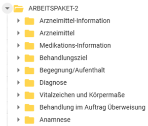

[Arbeitspaket 2 - abgeschlossen]: # 

### Inhalt

#### Arbeitspaket 2 (Deadline Kommentierung: 30.03.2026)

Informationsmodell

### Kommentarauflösung

Nach Abschluss der Kommentierung und der Prüfung sowie Bewertung aller eingegangenen Kommentare ist hier ein Überblick zu den eingegangenen Kommentaren und den Bewertungsergebnissen einsehbar. Hier kann entnommen werden, an welchen Stellen ein Kommentar zu einer Überarbeitung oder zur Aufnahme von Operationalisierungsempfehlungen für die umsetzenden IT-Systeme geführt haben.

| SteNa | Bedeutung |
| --- | --- |
| OK | Kommentar wird umgesetzt und eingearbeitet. |
| NOK | Änderung des Dokumentes ist nicht erforderlich, die Begründung wird angegeben. |
| Wdh. | Wiederholung – keine eigene Stellungnahme, da schon in anderem Kommentar behandelt. Auf entsprechenden Kommentar wird verwiesen. |
| Offen | Klärung steht aus (z. B. über Workshop). |

#### Allgemein

| Kommentar | Betreffendes Element | SteNa | Antwort |
| --- | --- | --- | --- |
| Ein offizielles Diagramm der FHIR-Objekte wäre hilfreich. | generell | Offen | Wir nehmen das Thema als Anregung mit. |
| Codierung nach z.B. LOINC oder SNOMED (wenn nicht hart codiert) liegt im AIS üblicherweise nicht vor | generell | NOK | Uns ist bekannt, dass LOINC- oder SNOMED-CT-Codierungen in den Systemen häufig oft noch nicht vorhanden sind. Wir sehen standardisierte Codes aber als einen wichtigen Schritt Richtung Interoperabilität. Deshalb geben wir, wo möglich, Beispiel-ValueSets und Hinweise zur Codierung mit. |

#### Inhalt

| Kommentar | Betreffendes Element in FHIR | SteNa | Antwort |
| --- | --- | --- | --- |
| Die Kennzeichnung von medizinischen Einträgen mit einer Begegnung ist in einigen AIS zentraler Bestandteil des Datenschutzes. Durch die Kennzeichnung eines Eintrags mit Arzt und Betriebsstätte über die Begegnung kann die Zugehörigkeit gekennzeichnet werden. Die Kardinalität sollte wie bei der KBV\_PR\_WEST\_Observation\_Anamnese 0..1 sein. | KBV\_PR\_WEST\_Observation\_Abdominal\_Circumference   {::nomarkdown}<ul title=""><li data-uuid="37d7ca5e-e291-415b-9188-b4cd1a8427bc">encounter</li></ul>{:/} | OK | Eine Referenz auf die Begegnung wurde hinzugefügt. |
| Die Kennzeichnung von medizinischen Einträgen mit einer Begegnung ist in einigen AIS zentraler Bestandteil des Datenschutzes. Durch die Kennzeichnung eines Eintrags mit Arzt und Betriebsstätte über die Begegnung kann die Zugehörigkeit gekennzeichnet werden. Die Kardinalität sollte wie bei der KBV\_PR\_WEST\_Observation\_Anamnese 0..1 sein. | KBV\_PR\_WEST\_Observation\_Blood\_Pressure   {::nomarkdown}<ul title=""><li data-uuid="a8cec4bc-43e3-4f26-bb7e-bf2f8a7bb207">encounter</li></ul>{:/} | OK | Eine Referenz auf die Begegnung wurde hinzugefügt. |
| Die Kennzeichnung von medizinischen Einträgen mit einer Begegnung ist in einigen AIS zentraler Bestandteil des Datenschutzes. Durch die Kennzeichnung eines Eintrags mit Arzt und Betriebsstätte über die Begegnung kann die Zugehörigkeit gekennzeichnet werden. Die Kardinalität sollte wie bei der KBV\_PR\_WEST\_Observation\_Anamnese 0..1 sein. | KBV\_PR\_WEST\_Observation\_Body\_Height   {::nomarkdown}<ul title=""><li data-uuid="503cc15f-610b-4ec5-a47f-e28f50eab983">encounter</li></ul>{:/} | OK | Eine Referenz auf die Begegnung wurde hinzugefügt. |
| Die Kennzeichnung von medizinischen Einträgen mit einer Begegnung ist in einigen AIS zentraler Bestandteil des Datenschutzes. Durch die Kennzeichnung eines Eintrags mit Arzt und Betriebsstätte über die Begegnung kann die Zugehörigkeit gekennzeichnet werden. Die Kardinalität sollte wie bei der KBV\_PR\_WEST\_Observation\_Anamnese 0..1 sein. | KBV\_PR\_WEST\_Observation\_Body\_Temperature   {::nomarkdown}<ul title=""><li data-uuid="294d0878-7774-4c7e-a1d6-4b5978a784ae">encounter</li></ul>{:/} | OK | Eine Referenz auf die Begegnung wurde hinzugefügt. |
| Die Kennzeichnung von medizinischen Einträgen mit einer Begegnung ist in einigen AIS zentraler Bestandteil des Datenschutzes. Durch die Kennzeichnung eines Eintrags mit Arzt und Betriebsstätte über die Begegnung kann die Zugehörigkeit gekennzeichnet werden. Die Kardinalität sollte wie bei der KBV\_PR\_WEST\_Observation\_Anamnese 0..1 sein. | KBV\_PR\_WEST\_Observation\_Body\_Weight   {::nomarkdown}<ul title=""><li data-uuid="28147c4f-62ef-4289-930e-e2c9a3f34eb2">encounter</li></ul>{:/} | OK | Eine Referenz auf die Begegnung wurde hinzugefügt. |
| Die Kennzeichnung von medizinischen Einträgen mit einer Begegnung ist in einigen AIS zentraler Bestandteil des Datenschutzes. Durch die Kennzeichnung eines Eintrags mit Arzt und Betriebsstätte über die Begegnung kann die Zugehörigkeit gekennzeichnet werden. Die Kardinalität sollte wie bei der KBV\_PR\_WEST\_Observation\_Anamnese 0..1 sein. | KBV\_PR\_WEST\_Observation\_Glucose\_Concentration   {::nomarkdown}<ul title=""><li data-uuid="15d45002-da85-4e11-8d8f-da347d077e30">encounter</li></ul>{:/} | OK | Eine Referenz auf die Begegnung wurde hinzugefügt. |
| Die Kennzeichnung von medizinischen Einträgen mit einer Begegnung ist in einigen AIS zentraler Bestandteil des Datenschutzes. Durch die Kennzeichnung eines Eintrags mit Arzt und Betriebsstätte über die Begegnung kann die Zugehörigkeit gekennzeichnet werden. Die Kardinalität sollte wie bei der KBV\_PR\_WEST\_Observation\_Anamnese 0..1 sein. | KBV\_PR\_WEST\_Observation\_Head\_Circumference   {::nomarkdown}<ul title=""><li data-uuid="45aa3ffc-7ec6-4d01-82f3-61483b99a5e7">encounter</li></ul>{:/} | OK | Eine Referenz auf die Begegnung wurde hinzugefügt. |
| Die Kennzeichnung von medizinischen Einträgen mit einer Begegnung ist in einigen AIS zentraler Bestandteil des Datenschutzes. Durch die Kennzeichnung eines Eintrags mit Arzt und Betriebsstätte über die Begegnung kann die Zugehörigkeit gekennzeichnet werden. Die Kardinalität sollte wie bei der KBV\_PR\_WEST\_Observation\_Anamnese 0..1 sein. | KBV\_PR\_WEST\_Observation\_Heart\_Rate   {::nomarkdown}<ul title=""><li data-uuid="847d959e-6926-4d25-90ff-d16e2756bc0d">encounter</li></ul>{:/} | OK | Eine Referenz auf die Begegnung wurde hinzugefügt. |
| Die Kennzeichnung von medizinischen Einträgen mit einer Begegnung ist in einigen AIS zentraler Bestandteil des Datenschutzes. Durch die Kennzeichnung eines Eintrags mit Arzt und Betriebsstätte über die Begegnung kann die Zugehörigkeit gekennzeichnet werden. Die Kardinalität sollte wie bei der KBV\_PR\_WEST\_Observation\_Anamnese 0..1 sein. | KBV\_PR\_WEST\_Observation\_Hip\_Circumference   {::nomarkdown}<ul title=""><li data-uuid="9c0a40cd-ce09-4dcc-b8c5-c0341fab2ba4">encounter</li></ul>{:/} | OK | Eine Referenz auf die Begegnung wurde hinzugefügt. |
| Die Kennzeichnung von medizinischen Einträgen mit einer Begegnung ist in einigen AIS zentraler Bestandteil des Datenschutzes. Durch die Kennzeichnung eines Eintrags mit Arzt und Betriebsstätte über die Begegnung kann die Zugehörigkeit gekennzeichnet werden. Die Kardinalität sollte wie bei der KBV\_PR\_WEST\_Observation\_Anamnese 0..1 sein. | KBV\_PR\_WEST\_Observation\_Peripheral\_Oxygen\_Saturation   {::nomarkdown}<ul title=""><li data-uuid="e6ecb131-7fc2-4c31-ad6e-62b48e486ec0">encounter</li></ul>{:/} | OK | Eine Referenz auf die Begegnung wurde hinzugefügt. |
| Die Kennzeichnung von medizinischen Einträgen mit einer Begegnung ist in einigen AIS zentraler Bestandteil des Datenschutzes. Durch die Kennzeichnung eines Eintrags mit Arzt und Betriebsstätte über die Begegnung kann die Zugehörigkeit gekennzeichnet werden. Die Kardinalität sollte wie bei der KBV\_PR\_WEST\_Observation\_Anamnese 0..1 sein. | KBV\_PR\_WEST\_Observation\_Respiratory\_Rate   {::nomarkdown}<ul title=""><li data-uuid="81898dc2-95db-453f-9ac7-9d75c78468c2">encounter</li></ul>{:/} | OK | Eine Referenz auf die Begegnung wurde hinzugefügt. |
| Wie bei "KBV\_PR\_WEST\_Observation\_Abdominal\_Circumference" sollte eine feste Einheit vorgegeben werden. So ist ein späterer Import gewährleistet, da nicht für alle möglichen Einheiten ein Konverter geschrieben werden muss. { "unit": "centimeter", "system": "<http://unitsofmeasure.org> ", "code": "cm" } | KBV\_PR\_WEST\_Observation\_Body\_Height   {::nomarkdown}<ul title=""><li data-uuid="8512202f-8a2d-476a-a081-4561fee37fa4">value[x]:valueQuantity</li></ul>{:/} | NOK | Es ist ein VS-Binding hinterlegt, welches die Einheiten Meter (m) und Centimeter (cm) erlaubt. Die Festlegung auf eine einzige Einheit löst das Problem eines eventuellen Konvertierungsbedarfs z.B. von cm in m aus unserer Sicht nicht, sondern verstärkt es. Z.B. wenn in PVS A sowie B die Einheit cm vorgesehen ist, aber in dem Profil cm vorgegeben wird, muss zweimal konvertiert werden, beim Export und Import. Wenn beide Einheiten erlaubt sind, muss nur beim Import konvertiert werden. |
| Hier wäre es sinnvoll, eine feste Codierung festzulegen. Diese sollte möglichst einheitlich über Observation erfolgen: links, rechts, beidseits. | KBV\_PR\_WEST\_Observation\_Blood\_Pressure | NOK | Mit dem Element ist nicht die Körperseite, sondern die Körperstelle gemeint. Es ist jetzt ein Beispiel-Valueset in SNOMED CT bereitgestellt, das bei Bedarf verwendet werden kann: "KBV\_PR\_WEST\_Observation\_Blood\_Pressure.bodySite". Zudem wurde im Element "Methode" ein Beispiel-Valueset hinzugefügt: KBV\_PR\_WEST\_Observation\_Blood\_Pressure.method |
| Hier sollte eine feste Einheit wie mmHg festgelegt werden. | KBV\_PR\_WEST\_Observation\_Blood\_Pressure   {::nomarkdown}<ul title=""><li data-uuid="f97525fc-6295-4a44-9f27-122a08e56164">component:SystolicBP.value[x]:valueQuantity.unit</li><li data-uuid="9c4a38b9-a7d5-47a9-ad2c-950c06ed7a85">component:DiastolicBP.value[x]:valueQuantity.unit</li><li data-uuid="867d1047-9a49-4073-8155-2a8a7787469b">component:meanBP.value[x]:valueQuantity.unit</li></ul>{:/} | NOK | Unter *component:SystolicBP.value[x]:valueQuantity*, *component:DiastolicBP.value[x]:valueQuantity* und *component:meanBP.value[x]:valueQuantity* ist jeweils ein pattern hinterlegt, welches nur die Einheit "mm[Hg]" zulässt. |
| Hier sollte eine feste Einheit wie g oder kg festgelegt werden. | KBV\_PR\_WEST\_Observation\_Body\_Weight   {::nomarkdown}<ul title=""><li data-uuid="2044d0b1-621e-4b57-bd92-fdaebafbb22a">value[x]:valueQuantity.unit</li></ul>{:/} | NOK | Unter valueQuantity ist ein VS-Binding hinterlegt, welches nur die Einheiten "kg" und "g" zulässt. |
| Hier sollte eine feste Einheit wie "1/Minute" festgelegt werden | KBV\_PR\_WEST\_Observation\_Heart\_Rate   {::nomarkdown}<ul title=""><li data-uuid="cdcb35c5-6b21-45fd-9949-0ff5f303fe02">value[x]:valueQuantity.unit</li></ul>{:/} | NOK | Unter valueQuantity ist bereits ein pattern hinterlegt, welches nur die Einheit "/min" zulässt. |
| Hier sollte eine feste Einheit wie "1/Minute" festgelegt werden | KBV\_PR\_WEST\_Observation\_Respiratory\_Rate   {::nomarkdown}<ul title=""><li data-uuid="2a2695cf-1af4-4786-9e00-74c9981525d7">value[x]:valueQuantity.unit</li></ul>{:/} | NOK | Unter valueQuantity ist bereits ein pattern hinterlegt, welches nur die Einheit "/min" zulässt. |
| Hier sollte eine feste Einheit wie "%" festgelegt werden | KBV\_PR\_WEST\_Observation\_Peripheral\_Oxygen\_Saturation   {::nomarkdown}<ul title=""><li data-uuid="9faef1fc-2aff-4ed3-8791-633c8d5e7a5b">value[x]:valueQuantity.unit</li></ul>{:/} | NOK | Unter valueQuantity ist bereits ein pattern hinterlegt, welches nur die Einheit "%" zulässt. |
| Hier sollte wie bei den anderen Observationen ein fester Code hinterlegt werden. Oder eine fest vorgegebene Code-Auswahl wie bspw. "nüchtern, vor Mahlzeit, nach Mahlzeit" oder die Unterscheidung zwischen 2345-7 Glucose [Mass/volume] in Serum or Plasma und 14743-9 Glucose [Moles/volume] in Capillary blood by Glucometer. | KBV\_PR\_WEST\_Observation\_Glucose\_Concentration   {::nomarkdown}<ul title=""><li data-uuid="9eac9503-2bca-466e-80ca-e63124f43766">code.coding:loinc</li></ul>{:/} | OK | Dieses Profil beschreibt die Messung eines einzelnen Glukosespiegels als sogenannte Point-of-Care-Testung (also einer Messung am Krankenbett oder in der unmittelbaren Nähe zur behandelten Person), oder auch durch die behandelte Person selbst. Die Abbildung der von Ihnen genannten zeitlichen Kontexte erfolgt in dem Profil zum Teil schon unter unter KBV\_PR\_WEST\_Observation\_Glucose\_Concentration.method.coding Die weiter vorgeschlagenen Codes (2345-7 Glucose [Mass/volume] in Serum or Plasma und 14743-9 Glucose [Moles/volume] in Capillary blood by Glucometer) beschreiben die Art der Bestimmung, wobei in diesem Profil nur "Glucose [Moles/volume] in Capillary blood by Glucometer" relevant ist. Für eine Bestimmung des Glucosespiegels in einem Labor sollte ein Profil für Laborwert verwendet werden. Wir werden die Beschreibung der Elemente sowie die Codes in Abstimmung mit dem Projekt KBV-Basis anpassen, damit der Scope des Profils deutlicher wird. Zudem wird es die Möglichkeit geben, Laborwerte abzubilden. Dies wird in enger Abstimmung mit dem Projekt MIO Laborbefund entwickelt. |
| Wenn es eine Referenz auf Encounter gibt: Welche abweichenden Informationen sollen hier eingetragen werden? Wenn Encounter vorhanden ist, könnte performer die Kardinalität 0..0 haben. | KBV\_PR\_WEST\_Observation\_Anamnese   {::nomarkdown}<ul title=""><li data-uuid="f3354e74-2c71-4d13-aa44-0855cab7e844">performer</li></ul>{:/} | NOK | Observation.encounter gibt den Versorgungskontext an, Observation.performer hingegen die Person, welche die Anamnese durchführt. Dies sind unterschiedliche Rollen, daher kann Performer nicht die Kardinalität 0..0 haben. |
| Hier wäre es sinnvoll, eine feste Codierung festzulegen. Diese sollte möglichst einheitlich sein: links, rechts, beidseits. | KBV\_PR\_WEST\_Condition   {::nomarkdown}<ul title=""><li data-uuid="dc851de7-9472-4694-ba9c-ba0752c3fea6">bodySite</li></ul>{:/} | OK | Die Seitenlokalisation ist im ICD-Code enthalten. Das Element "Bodysite", um das es hier geht, meint die Körperstelle. Alle hier möglichen Codes vorzugeben, würde den Rahmen sprengen. Wir haben aber ein Slice für SNOMED-CT Codes hinzugefügt mit dem Hinweis, dass dort alle Codes vom Typ "Body Structure" verwendet werden sollen. |
| Der ICD-10-GM Code sollte verpflichtend sein. Bei den anderen Codierungen ist nicht gewährleistet, dass diese wieder importiert werden können. Gerade bei einer Überweisung sind die Codes relevant für eine Abrechnung. | KBV\_PR\_WEST\_Condition   {::nomarkdown}<ul title=""><li data-uuid="d5391fae-1ae6-4b57-9a16-848dd8c18487">code.coding:ICD-10-GM</li></ul>{:/} | NOK | Das Ziel der Wechselschnittstelle ist es, Daten zu transferieren und nicht, zu prüfen, ob sie vollständig sind. Die Prüfung auf Vollständigkeit sollte erfolgen, wenn Daten in verschiedenen Kontexten übertragen werden, z.B. für Abrechnungen. Prüfmechanismen für alle möglichen Kontexte festzulegen ist kein Teil der Wechselschnittstelle. Im Gegenteil ist es das Ziel der Wechselschnittstelle, so viele Daten wie möglich möglichst reibungsfrei zu übertragen. |
| Hier sollten die Codes für *gesichert* , *ausgeschlossen* , *Verdacht auf*  etc. fest vorgegeben werden. Ein Import kann sonst eventuell nicht möglich sein, wenn die Codierung nicht in die vom ICD-10 vorgeschriebenen Kategorien zurückgemappt werden kann. | KBV\_PR\_WEST\_Condition   {::nomarkdown}<ul title=""><li data-uuid="d37ba566-70ed-42a7-899b-9a99a2d206a4">severity.coding</li></ul>{:/} | NOK | Dies wird im Profil KBV\_PR\_WEST\_Condition über das Element verificationStatus abgebildet. |
| Hier wäre eine Festlegung auf einen Datumstyp sinnvoll. | KBV\_PR\_WEST\_Condition   {::nomarkdown}<ul title=""><li data-uuid="3d6be9c1-1b07-4aef-be40-2f6679faa2f8">extension:Feststellungsdatum.value[x]</li></ul>{:/} | OK | Ein Datumstyp wurde festgelegt. |
| Die Diagnosekategorie und die Diagnoseart im Profil Condition sind nicht abrufbar. | KBV\_PR\_WEST\_Condition   {::nomarkdown}<ul title=""><li data-uuid="73c4d462-1da4-49e7-a1e5-b50de3b622af">category:diagnosekategorie.coding.system</li><li data-uuid="d267f357-3553-498c-8743-bde5eff7d5a2">category:diagnoseart.coding.system</li></ul>{:/} | OK | Die Links wurden in simplifier korrigiert. |
| Hier wäre es gut, wenn ein Codiersystem hinterlegt ist. | KBV\_PR\_WEST\_Encounter   {::nomarkdown}<ul title=""><li data-uuid="9df73750-8dbf-4af2-a001-c24363942d6f">serviceType.coding:KBV-Fachgruppencodierung.system</li></ul>{:/} | NOK | Das Codiersystem ist bereits im Pattern des Elements serviceType.coding:KBV-Fachgruppencodierung hinterlegt. Zudem ist ein Valueset-Binding (required) vorhanden. |
| [https://fhir.kbv.de/StructureDefinition/KBV\_EX\_WEST\_Begegnung\_Spezielle\_Begegnungsinformationen](https://fhir.kbv.de/StructureDefinition/KBV_EX_WEST_Begegnung_Spezielle_Begegnungsinformationen%20könnte%20besser%20beschrieben%20werden,%20um%20welche%20Inhalte%20es%20sich%20handelt.%20Dies%20wäre%20ein%20zusätzliches%20Profil.%20Für%20eine%20Verprobung%20sollte%20ein%20gesammthaftes%20Paket%20aller%20notwendigen%20Profile%20und%20Codesystem%20zusammengestellt%20werden.)     Es könnte besser beschrieben werden, um welche Inhalte es sich handelt. Dies wäre ein zusätzliches Profil. Für eine Verprobung sollte ein vollständiges Paket aller notwendigen Profile und Codesysteme zusammengestellt werden. | KBV\_PR\_WEST\_Encounter   {::nomarkdown}<ul title=""><li data-uuid="1af06907-798d-471a-85dc-dcc8a7d63b1a">extension:spezielle_Begegnungsinformationen</li></ul>{:/}   KBV\_EX\_WEST\_Begegnung\_Spezielle\_Begegnungsinformationen | OK | Es handelt sich hier um einen technischen Workaround, der es im Vorgängerprojekt AWS erlaubt hat, in Ausnahmefällen Dummy-Begegnungen zu erstellen, siehe [https://update.kbv.de/ita-update/371-Schnittstellen/PVS-Archivierungs-Wechsel-Schnittstelle/KBV\_ITA\_VGEX\_Anforderungskatalog\_AW\_SST.pd](https://update.kbv.de/ita-update/371-Schnittstellen/PVS-Archivierungs-Wechsel-Schnittstelle/KBV_ITA_VGEX_Anforderungskatalog_AW_SST.pdf?utm_source=chatgpt.com)f     Die Beschreibung wurde wie unten zu lesen angepasst. Außerdem werden wir bei Vollständigkeit des Informationsmodells prüfen, ob das Element in der WeST den gleichen Stellenwert hat wie in der AWS oder ob es entfernt werden kann.     Angepasste Beschreibung:     Zusatzinformationen zur Begegnung, die nicht durch die regulären Encounter-Elemente oder durch andere fachliche Profile abgebildet werden. Sie dient der Erhaltung encounter-bezogener Kontextinformationen, insbesondere, wenn ein Inhalt eine Begegnung referenziert werden muss, um technisch valide zu sein, aber fachlich keine Begegnung zugeordnet werden kann. In diesem Fall ist die Instanz der Begegnung eine Dummy-Begegnung sein, mit der Extension „spezielle Begegnungsinformationen“ und folgenden Inhalt: Typ = Dummy Inhalt = Dummy |
| Liegt im AIS üblicherweise nicht strukturiert vor. | KBV\_PR\_WEST\_Observation\_Anamnese   {::nomarkdown}<ul title=""><li data-uuid="e8d2f151-e75d-4318-acc3-061060014955">code</li></ul>{:/} | NOK | Der Code wird für FHIR benötigt. Der Code ist fest vorgegeben und sagt aus, dass es sich bei diesem Profil um eine *Anamnese*  handelt. Die Benutzung des Profils reicht aus, um diesen Code anzubieten. |
| Wird üblicherweise aus den Arzneimitteldatenbanken der AIS ermittelt. An dieser Stelle unnötig? | KBV\_PR\_WEST\_MedicationKnowledge | Offen | Diese Ressource wurde aufgenommen, weil bestimmte Informationen daraus in der xBDT-Spezifikation aufgeführt sind. Sollten auch andere diese Ressource als unnötig sehen, können wir sie entfernen. Für Feedback wird bei einer Kommentierung Raum gegeben. Wir werden die konkrete Frage nach dem Nutzen dieser Ressource notieren und bei einer Kommentierung um weiteres Feedback bitten. |
| Beschreibung im Modell: Hier werden Angaben dazu gemacht, wie ein bestimmtes Arzneimittel eingenommen bzw. verabreicht wird oder werden soll.        Unter Simplifier: Diese Ressource bietet die Möglichkeit anzugeben, ob eine Medikation im System als Dauermedikation deklariert wurde." | KBV\_PR\_WEST\_MedicationStatement | OK | Die Beschreibung in FHIR wurde entsprechend angepasst. |
| Element löschen: Da der Status immer "final" ist, werden so nur unnötige Daten für eine Migration generiert. Dieses Feld bringt keinen Mehrwert bei der Migration | KBV\_PR\_WEST\_Observation\_Anamnese   {::nomarkdown}<ul title=""><li data-uuid="a0fa7284-948d-463f-9bdd-a39c9f539830">status</li></ul>{:/} | NOK | Das Element ist in FHIR nicht verzichtbar. |
| Element und Sub-Elemente löschen: Im FHIR Kontext mag dieses Feld absolut seine Berechtigung haben. Wenn wir aber eine performante ressourcenschonende Migration wollen, sind solche Felder nicht sinnvoll. Im xBDT ist dies über die Feldnummer gelöst. So wird verstanden, dass es sich um die Anamese handelt. Es ist keine zusätzliche Kodifizierung nötig. | KBV\_PR\_WEST\_Observation\_Anamnese   {::nomarkdown}<ul title=""><li data-uuid="77349947-efbb-4614-ad97-da85992af94c">code und alle Unterelemente</li></ul>{:/} | NOK | Das Element ist in FHIR nicht verzichtbar. |
| Laut Informationsmodell ist eine Anamnese nur mit einem Typ möglich. Sollte nicht mindestens auch die Beschreibung - also der tatsächliche Inhalt - verpflichtend sein? | KBV\_PR\_WEST\_Observation\_Anamnese | OK | Ja, die Beschreibung verpflichtend zu machen, ist sinnvoll, wir haben die Kardinalität angepasst. |
| Element löschen: Der Status hat nur ein Element im ValueSet. Dieses Feld bringt keinen Mehrwert bei der Migration | KBV\_PR\_WEST\_ServiceRequest   {::nomarkdown}<ul title=""><li data-uuid="53ec8619-492b-473b-a5a5-f2e219ec9734">status</li></ul>{:/} | NOK | Das Element ist in FHIR nicht verzichtbar. |
| Element löschen: Die Auftragsart hat nur ein Element im ValueSet. Dieses Feld bringt keinen Mehrwert bei der Migration | KBV\_PR\_WEST\_ServiceRequest   {::nomarkdown}<ul title=""><li data-uuid="163c7ad0-8caf-4e4d-a44f-5a6554d5cb8f">intent</li></ul>{:/} | NOK | Das Element ist in FHIR nicht verzichtbar. |
| Uns ist die Angabe der Kardinalität nicht klar. Warum wird hier zwischen Patientenakte und Arbeitspaket-2 unterschieden? Wie könnte eine kurative ASV Überweisung mit der Kardinalität 1..1 abgebildet werden? | KBV\_PR\_WEST\_ServiceRequest   {::nomarkdown}<ul title=""><li data-uuid="bc757540-5374-4081-8501-19016ce9e587">category</li></ul>{:/} | OK | Das ist ein Fehler unsererseits. Gültig ist nur die Kardinalität aus Arbeitspaket-2. |
| Durch die 1..1 Kardinalität muss die Referenz zur Begegnung hergestellt werden. Was passiert, wenn das exportierende System diese Referenz nicht hat? | KBV\_PR\_WEST\_ServiceRequest   {::nomarkdown}<ul title=""><li data-uuid="04644c20-defc-4400-963b-63f09c3f4908">encounter</li></ul>{:/} | OK | Das zusätzliche Szenario "Patientenakte" ist ein Fehler unsererseits. Gültig ist nur das Szenario Arbeitspaket-2. Wenn keine echte Begegnung angegeben werden kann, kann eine Dummy-Begegnung angelegt werden mit der Extension „spezielle Begegnungsinformationen“ und folgenden Inhalt: Typ = Dummy Inhalt = Dummy |
| Uns ist die Angabe der Kardinalität nicht klar. Warum wird hier zwischen Patientenakte und Arbeitspaket-2 unterschieden? Warum kann auf einmal das Ausstellungdatum optional sein? | KBV\_PR\_WEST\_ServiceRequest   {::nomarkdown}<ul title=""><li data-uuid="eb83e886-4c89-4c63-b296-602dcec2442d">authoredOn</li></ul>{:/} | OK | Das ist ein Fehler unsererseits. Gültig ist nur die Kardinalität aus Arbeitspaket-2, also die Kardinalität 0..1 |
| Im Informationsmodell des AP2 fehlt eine Ressource zur Abbildung durchgeführter medizinischer Maßnahmen (FHIR Procedure). Prozeduren sind ein zentraler Bestandteil der Patientenakte und umfassen diagnostische Eingriffe (z.B. Endoskopien, Biopsien, bildgebende Untersuchungen), therapeutische Maßnahmen (Operationen, Interventionen) sowie präventive Leistungen (Screenings, Früherkennungsuntersuchungen). Ohne ein Procedure-Profil können wesentliche Teile der Behandlungshistorie bei einem Systemwechsel nicht übertragen werden.        Beispiel: Im Lungenkrebs-Screening (KBV-Screening-Programm als GKV-Leistung, ab 01.04.2026) ist die Dokumentation der durchgeführten Niedrigdosis-CT als Prozedur mit OPS-Kodierung essenziell. Auch die S3-Leitlinie 'Rauchen und Tabakabhängigkeit' (AWMF 076-006, Empfehlung 4.7.3.3) verweist explizit auf OPS 9-501 zur Tabakentwöhnung als kodierbare Prozedur im DRG-System.        Änderungsvorschlag: Aufnahme eines Procedure-Profils in das Informationsmodell, das diagnostische, therapeutische und präventive Maßnahmen mit z.B. OPS-Kodierung abbilden kann. |  | OK | Die Möglichkeit Abbildung einer Prozedur ist geplant und wird im abgeschlossenen Informationsmodell vorhanden sein. |
| Es fehlt ein Profil für diagnostische Berichte (FHIR DiagnosticReport). Befundberichte aus Bildgebung, Labor und Pathologie sind ein wesentlicher Bestandteil der hausärztlichen Patientenakte und werden regelmäßig von anderen Leistungserbringern empfangen. Ohne DiagnosticReport können strukturierte Befunde – im Unterschied zu reinen Freitextdokumenten – nicht über die Wechselschnittstelle übertragen werden.        Beispiel: Im Lungenkrebs-Screening enthalten LDCT-Befundberichte strukturierte Angaben z.B. zur Klassifikation (Lung-RADS), die für den Hausarzt in der Nachverfolgung entscheidend sind.        Änderungsvorschlag: Aufnahme eines DiagnosticReport-Profils, das bildgebende, labormedizinische und pathologische Befunde strukturiert abbilden kann. |  | OK | Die Möglichkeit Abbildung eines Befundberichtes (DiagnosticReport) ist geplant und wird im abgeschlossenen Informationsmodell vorhanden sein. Die Gruppe Freitextanamnese ist davon getrennt modelliert worden und für verschiedenste Notizen eines Arztes gedacht, die nicht die Struktur und Tiefe eines Befundberichtes haben. |
| Das Anamnese-Profil ist generisch gehalten und erlaubt keine strukturierte Erfassung spezifischer Risikofaktoren. In der hausärztlichen Versorgung werden zahlreiche verhaltens- und expositionsbezogene Risikofaktoren erhoben (Raucherstatus, Alkoholkonsum, berufliche Exposition, Ernährungsgewohnheiten), die für Prävention, Screening und Therapieentscheidungen relevant sind. Das aktuelle Profil bietet keine Möglichkeit, diese Informationen kodiert und strukturiert zu übertragen.        Beispiel: Für das Lungenkrebs-Screening ist die Raucheranamnese mit Pack-Years, Rauchdauer und Rauchstopp-Zeitpunkt gemäß LuKrFrühErkV zwingend erforderlich (LOINC 72166-2 Tobacco smoking status). Bei einem Wechsel gehen diese strukturierten Daten verloren.        Änderungsvorschlag: Erweiterung des Anamnese-Profils um strukturierte, kodierte Felder für verhaltensbezogene und expositionsbezogene Risikofaktoren (z.B. über LOINC-kodierte Observations). |  | Offen | Einzelne ausgewählte Spezial-Profile wie Raucherstatus **und Schmerzskala** sind in Planung. **Außerdem wird das Modell um ein allgemeines Assessment und einen DignosticReport ergänzt.**     Für Inhalte, die vermutlich in vielen PVS nicht in einer mit FHIR vergleichbaren Strukturiertheit vorliegen, muss zwischen klinischem Nutzen, den wir durchaus sehen, und der praktischen Realisierbarkeit, die bereits bei dem Vorgängerprojekt AWS 1.3.0 ein Problem darstellte, abgewogen werden.     Es kann daher sein, dass die strukturierte Abbildung komplexer medizinischer Sachverhalte zunächst nicht in vollem Ausmaß realisiert werden kann.     Wir nehmen das Thema mit und versuchen, eine Lösung zu finden, die wir für die weitere Entwicklung berücksichtigen werden. |
| Die vorhandenen Observation-Profile beschränken sich auf klassische Vitalzeichen und Körpermaße. In der hausärztlichen Versorgung werden darüber hinaus regelmäßig klinische Scores und funktionelle Parameter erhoben, die nicht abgebildet werden können: Leistungsstatus (ECOG, Karnofsky), Schmerzskalen (NRS/VAS), funktionelle Assessments (z.B. geriatrisches Assessment, Barthel-Index) sowie krankheitsspezifische Scores (z.B. COPD Assessment Test, HbA1c-Verlauf).        Beispiel: In der onkologischen Nachsorge bei Lungenkrebspatienten sind ECOG-Performance-Status und Schmerzskalen essenziell für Therapieentscheidungen und die Verlaufsbeurteilung.        Änderungsvorschlag: Ergänzung eines generischen Observation-Profils für klinische Scores und funktionelle Parameter oder Erweiterung des Modells über die bisherigen Vitalzeichen hinaus. |  | Offen | Einzelne ausgewählte Spezial-Profile wie Raucherstatus **und Schmerzskala** sind in Planung. **Außerdem wird das Modell um ein allgemeines Assessment und einen DignosticReport ergänzt.**  Für Inhalte, die vermutlich in vielen PVS nicht in einer mit FHIR vergleichbaren Strukturiertheit vorliegen, muss zwischen klinischem Nutzen, den wir durchaus sehen, und der praktischen Realisierbarkeit, die bereits bei dem Vorgängerprojekt AWS 1.3.0 ein Problem darstellte, abgewogen werden.  Es kann daher sein, dass die strukturierte Abbildung komplexer medizinischer Sachverhalte zunächst nicht in vollem Ausmaß realisiert werden kann.  Wir nehmen das Thema mit und versuchen, eine Lösung zu finden, die wir für die weitere Entwicklung berücksichtigen werden. |
| Das Condition-Profil unterstützt ICD-10-GM, SNOMED CT, Alpha-ID und Orphanet. Für Erkrankungen, die eine Stadien- oder Schweregradklassifikation erfordern, fehlt jedoch die Möglichkeit, diese strukturiert abzubilden. Dies betrifft nicht nur onkologische Erkrankungen (TNM-Klassifikation, UICC-Stadium, Grading), sondern auch z.B. chronische Niereninsuffizienz (KDIGO-Stadien), Herzinsuffizienz (NYHA-Klassen) oder COPD (GOLD-Stadien).        Beispiel: Bei Lungenkrebspatienten ist das TNM-Stadium (cTNM/pTNM) mit UICC-Gesamtstadium therapieentscheidend und muss bei sektorübergreifender Versorgung (§ 374 SGB V) übertragbar sein.        Änderungsvorschlag: Ergänzung von Extensions oder Referenzen auf Observation-Ressourcen für strukturierte Stadienklassifikationen und Schweregrade im Kontext der Diagnose. |  | OK | Wir haben das Informationsmodell um das Stadium erweitert. Ein offenes Assessment-Modell, auf das in der Stadienbeschreibung verwiesen werden kann, wird später hinzugefügt. |
| In der modernen Medizin werden zunehmend Biomarker und molekulare Befunde für Therapieentscheidungen herangezogen. Das aktuelle Informationsmodell bietet keine Möglichkeit, solche Befunde strukturiert zu übertragen. Dies betrifft molekularpathologische Marker, genetische Prädispositionen, immunologische Parameter und prädiktive Biomarker, die in vielen Fachdisziplinen relevant sind (Onkologie, Rheumatologie, Endokrinologie, Kardiologie).        Beispiel: Bei nicht-kleinzelligem Lungenkarzinom sind molekulare Marker wie EGFR, ALK, PD-L1, ROS1, BRAF V600E und KRAS G12C therapieentscheidend und werden auch in der hausärztlichen Nachsorge benötigt.        Änderungsvorschlag: Aufnahme eines Observation-Profils für Biomarker und molekulare Befunde oder Integration in ein DiagnosticReport-Profil mit Referenz auf die zugehörige Condition. |  | Offen | Einzelne ausgewählte Spezial-Profile wie Raucherstatus **und Schmerzskala** sind in Planung. **Außerdem wird das Modell um ein allgemeines Assessment und einen DignosticReport ergänzt.**  Für Inhalte, die vermutlich in vielen PVS nicht in einer mit FHIR vergleichbaren Strukturiertheit vorliegen, muss zwischen klinischem Nutzen, den wir durchaus sehen, und der praktischen Realisierbarkeit, die bereits bei dem Vorgängerprojekt AWS 1.3.0 ein Problem darstellte, abgewogen werden.  Es kann daher sein, dass die strukturierte Abbildung komplexer medizinischer Sachverhalte zunächst nicht in vollem Ausmaß realisiert werden kann.  Wir nehmen das Thema mit und versuchen, eine Lösung zu finden, die wir für die weitere Entwicklung berücksichtigen werden. |
| Es fehlt ein CarePlan-Profil zur Abbildung von Behandlungs- und Nachsorgeplänen. Strukturierte Behandlungspläne mit definierten Kontrollintervallen und geplanten Maßnahmen sind ein wesentliches Element der hausärztlichen Versorgungskoordination – insbesondere bei chronischen Erkrankungen, DMP-Programmen und Nachsorge. Ohne CarePlan können diese Informationen bei einem Systemwechsel nicht strukturiert übertragen werden.        Beispiel: Nach einer Lungenkrebsdiagnose werden Nachsorgepläne mit definierten Kontrollintervallen (mind. 12 Monate) erstellt; im Screening-Programm ist das jährliche LDCT-Intervall (§ 2 Abs. 1 Nr. 2, § 5 Abs. 3 LuKrFrühErkV) zu dokumentieren.        Änderungsvorschlag: Aufnahme eines CarePlan-Profils, das Behandlungspläne, Nachsorge-Intervalle und geplante Maßnahmen strukturiert abbilden kann. |  | Offen | Einzelne ausgewählte Spezial-Profile wie Raucherstatus **und Schmerzskala** sind in Planung. **Außerdem wird das Modell um ein allgemeines Assessment und einen DignosticReport ergänzt.**  Für Inhalte, die vermutlich in vielen PVS nicht in einer mit FHIR vergleichbaren Strukturiertheit vorliegen, muss zwischen klinischem Nutzen, den wir durchaus sehen, und der praktischen Realisierbarkeit, die bereits bei dem Vorgängerprojekt AWS 1.3.0 ein Problem darstellte, abgewogen werden.  Es kann daher sein, dass die strukturierte Abbildung komplexer medizinischer Sachverhalte zunächst nicht in vollem Ausmaß realisiert werden kann.  Wir nehmen das Thema mit und versuchen, eine Lösung zu finden, die wir für die weitere Entwicklung berücksichtigen werden. |
| Das Informationsmodell enthält keine Questionnaire-/QuestionnaireResponse-Profile. In der hausärztlichen Versorgung werden zahlreiche standardisierte Fragebögen und Assessments eingesetzt: geriatrische Assessments, Depressions-Screenings (PHQ-9), Lebensqualitätserhebungen und krankheitsspezifische Fragebögen. Die strukturierte Übertragung dieser Assessments ist bei einem Systemwechsel nicht möglich.        Beispiel: Im Lungenkrebs-Screening ist ein strukturierter Bericht erforderlich; in der Nachsorge können z.B. Lebensqualitäts-Fragebögen (z.B. EORTC QLQ-C30) eingesetzt werden.        Änderungsvorschlag: Aufnahme von Questionnaire-/QuestionnaireResponse-Profilen oder Berücksichtigung strukturierter Assessments im Informationsmodell. |  | Offen | Einzelne ausgewählte Spezial-Profile wie Raucherstatus **und Schmerzskala** sind in Planung. **Außerdem wird das Modell um ein allgemeines Assessment und einen DignosticReport ergänzt.**  Für Inhalte, die vermutlich in vielen PVS nicht in einer mit FHIR vergleichbaren Strukturiertheit vorliegen, muss zwischen klinischem Nutzen, den wir durchaus sehen, und der praktischen Realisierbarkeit, die bereits bei dem Vorgängerprojekt AWS 1.3.0 ein Problem darstellte, abgewogen werden.  Es kann daher sein, dass die strukturierte Abbildung komplexer medizinischer Sachverhalte zunächst nicht in vollem Ausmaß realisiert werden kann.  Wir nehmen das Thema mit und versuchen, eine Lösung zu finden, die wir für die weitere Entwicklung berücksichtigen werden. |
| Es fehlt ein DocumentReference-Profil zur Referenzierung externer Dokumente. In der hausärztlichen Versorgung fallen zahlreiche Fremddokumente an, die Teil der Patientenakte sind, z.B. Arztbriefe. Die Wechselschnittstelle sollte zumindest Metadaten und Referenzen auf diese Dokumente übertragen können, um die Vollständigkeit der Patientenakte bei einem Systemwechsel gemäß § 371 SGB V sicherzustellen.        Beispiel: Im Lungenkrebsbehandlungspfad sind z.B. Arztbriefe von Onkologen nach stationärer Behandlung für den Hausarzt in der Nachsorge unverzichtbar.         Änderungsvorschlag: Aufnahme eines DocumentReference-Profils zur strukturierten Verknüpfung klinischer Dokumente (Typ, Datum, Ersteller, Kategorie, Verweis auf Inhalt). |  | OK | Ein DocumentReference-Profil ist in Planung und wird im vollständigen Informationsmodell enthalten sein. |
| Das MedicationStatement-Profil ist auf Dauermedikation ausgerichtet. Zeitlich begrenzte, zyklische oder protokollbasierte Therapien können damit nicht adäquat abgebildet werden. Dies betrifft nicht nur onkologische Therapieschemata, sondern auch z.B. Antibiotikatherapien, Kortisonstoßtherapien, immunsuppressive Induktionstherapien oder zeitlich befristete Schmerztherapien. Therapiezyklen, Dosisanpassungen und Therapieabbrüche/-wechsel mit Begründung können nicht strukturiert dokumentiert werden.        Beispiel: In der Lungenkrebstherapie kommen zyklische Chemotherapie-, Immuntherapie- und zielgerichtete Therapieschemata zum Einsatz, deren Verlauf für den Hausarzt nachvollziehbar sein muss.        Änderungsvorschlag: Erweiterung des MedicationStatement um zeitlich begrenzte Therapien oder Ergänzung eines MedicationRequest-Profils mit Informationen zu Therapiezyklen und -protokollen. |  | Offen | Einzelne ausgewählte Spezial-Profile wie Raucherstatus **und Schmerzskala** sind in Planung. **Außerdem wird das Modell um ein allgemeines Assessment und einen DignosticReport ergänzt.**     Für Inhalte, die vermutlich in vielen PVS nicht in einer mit FHIR vergleichbaren Strukturiertheit vorliegen, muss zwischen klinischem Nutzen, den wir durchaus sehen, und der praktischen Realisierbarkeit, die bereits bei dem Vorgängerprojekt AWS 1.3.0 ein Problem darstellte, abgewogen werden.     Es kann daher sein, dass die strukturierte Abbildung komplexer medizinischer Sachverhalte zunächst nicht in vollem Ausmaß realisiert werden kann.     Wir nehmen das Thema mit und versuchen, eine Lösung zu finden, die wir für die weitere Entwicklung berücksichtigen werden. |
| Die supportingInfo-Slices im ServiceRequest (befund\_Medikation und Ausnahmeindikation) sind eng gefasst und decken nur spezifische Anwendungsfälle ab. Bei Überweisungen werden jedoch häufig weitergehende klinische Kontextinformationen mitgegeben: relevante Vorbefunde, Risikofaktoren, Nachweise für spezielle Leistungen oder konkrete Fragestellungen an den Empfänger. Eine flexible Erweiterung der supportingInfo wäre notwendig.        Beispiel: Raucherstatus, Pack-Years, etc. beim Lungenkrebs-Screening        Änderungsvorschlag: Ergänzung weiterer supportingInfo-Slices oder offenere Gestaltung der Referenzmöglichkeiten auf beliebige Observation-/Condition-Ressourcen als klinischer Kontext. |  | OK | Eine Möglichkeit für weitere Referenzen wurde hinzugefügt. Das stimmt überein mit einer möglichen Erweiterung der Überweisung im Rahmen der geplanten eÜberweisung. |
| Die vorhandenen Observation-Profile enthalten keine Abbildung von Laborwerten. Laborergebnisse sind ein zentraler Bestandteil nahezu jeder Patientenakte und werden in der hausärztlichen Versorgung regelmäßig erhoben und ausgewertet (Blutbild, Stoffwechselparameter, Organfunktionswerte, Entzündungsmarker, Schilddrüsenwerte u.v.m.).        Beispiel: In der Lungenkrebsnachsorge sind regelmäßige Laborkontrollen (Blutbild, LDH, Leber-/Nierenwerte) zur Therapieüberwachung und Rezidiverkennung Standard.        Änderungsvorschlag: Aufnahme eines generischen Laborwert-Observation-Profils oder eines DiagnosticReport-Profils für Laborbefunde in das Informationsmodell. |  | OK | Ein DiagnosticReport-Profil ist in Planung und wird im vollständigen Informationsmodell enthalten sein. |
| Das Informationsmodell bietet keine strukturierte Erfassung der Familienanamnese (FHIR FamilyMemberHistory). Die familiäre Krankheitsgeschichte ist für die hausärztliche Risikoeinschätzung bei zahlreichen Erkrankungen relevant: kardiovaskuläre Risiken, hereditäre Tumorprädispositionssyndrome, Diabetes, psychische Erkrankungen u.a. Diese Informationen werden typischerweise einmalig erhoben und über die gesamte Behandlungsdauer fortgeschrieben.        Beispiel: Bei Lungenkrebs erhöhen erstgradige Verwandte mit Lungenkarzinom das individuelle Risiko und sind für die Beurteilung der Screening-Indikation relevant.        Änderungsvorschlag: Ergänzung eines FamilyMemberHistory-Profils oder strukturierter Felder in der Anamnese zur kodierten Erfassung der familiären Krankheitsgeschichte. |  | Offen | Einzelne ausgewählte Spezial-Profile wie Raucherstatus **und Schmerzskala** sind in Planung. **Außerdem wird das Modell um ein allgemeines Assessment und einen DignosticReport ergänzt.**     Für Inhalte, die vermutlich in vielen PVS nicht in einer mit FHIR vergleichbaren Strukturiertheit vorliegen, muss zwischen klinischem Nutzen, den wir durchaus sehen, und der praktischen Realisierbarkeit, die bereits bei dem Vorgängerprojekt AWS 1.3.0 ein Problem darstellte, abgewogen werden.     Es kann daher sein, dass die strukturierte Abbildung komplexer medizinischer Sachverhalte zunächst nicht in vollem Ausmaß realisiert werden kann.     Wir nehmen das Thema mit und versuchen, eine Lösung zu finden, die wir für die weitere Entwicklung berücksichtigen werden. |

